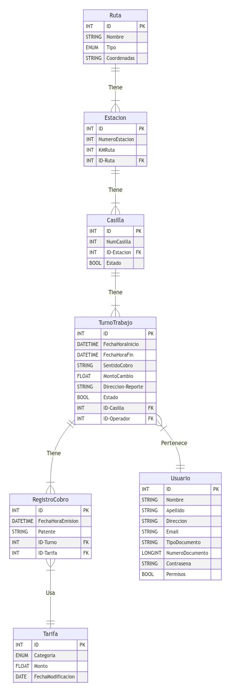
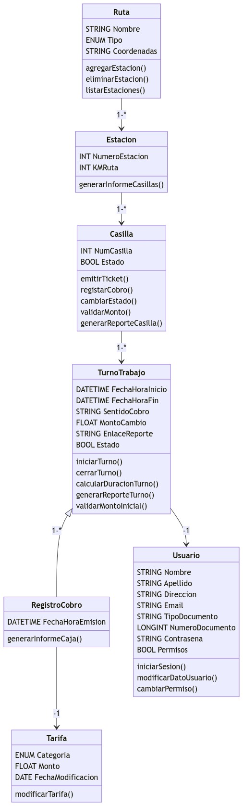

# Sistema de Peaje

[Introduccion](#introduccion)

[Instalacion](#instalacion)

[Diagrama Entidad-Relacion](#diagrama-entidad-relacion-del-sistema)

[Diagrama Clases](#diagrama-de-clases-del-sistema)


## Introduccion
Este proyecto consiste en implementar un sistema de gestión y control de peaje con el propósito de administrar de manera eficiente la recaudación en todas las estaciones de las rutas de la provincia de Córdoba.


## Instalacion

### Requisitos Previos

Python 3.10 requerido:

*input:*
```bash
    python --version
```

*output:*
```bash
    Python <numeroVersion>
```
<hr>

Django requerido:

*input:*
```bash
    pip install Django
```
<hr>
Pipenv requerido:


*input:*
```bash
    pip install pipenv
```

<hr>

#### Primer paso: Creacion Entorno Virtual

Va a ser muy importante trabajar con entornos virtuales ya que nos ayudará a evitar problemas relacionados con dependencias de bibliotecas y paquetes.

```bash
    pipenv install //Creacion
    pipenv shell //Ejecucion
```

#### Segundo paso: Instalacion de los modulos requeridos para su ejecucion

Una vez que estamos dentro del entorno virtual, debemos instalar todos los paquetes que se necesitaran para desarrollar/ejecutar el proyecto

```bash
    pipenv install -r requirements.txt
```

>Una vez hayas seguido estos pasos, podrás ejecutar y/o trabajar en el proyecto sin ningún problema.

## Diagrama Entidad-Relacion Del Sistema



## Diagrama De Clases Del Sistema


