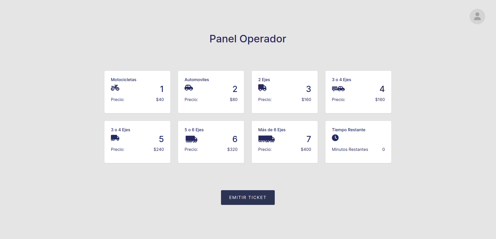
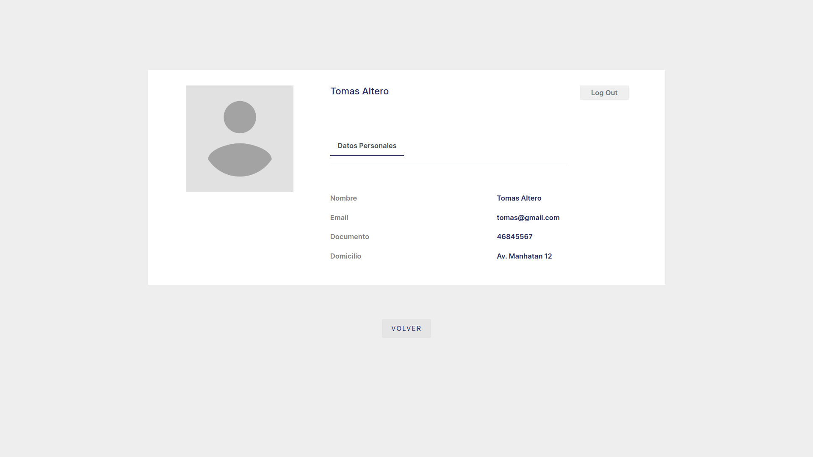
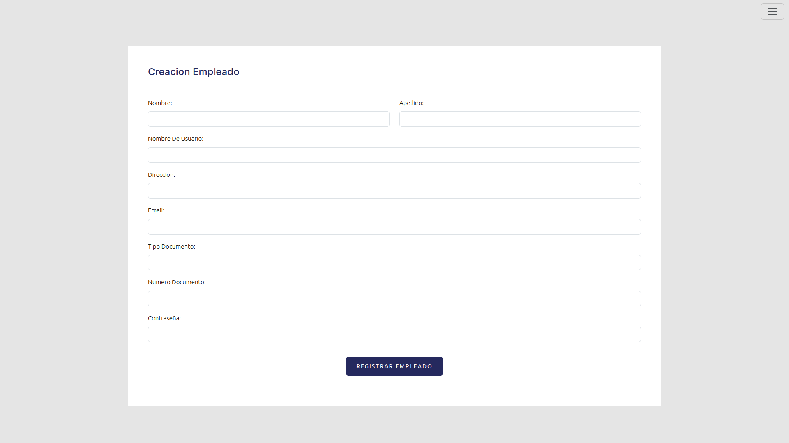
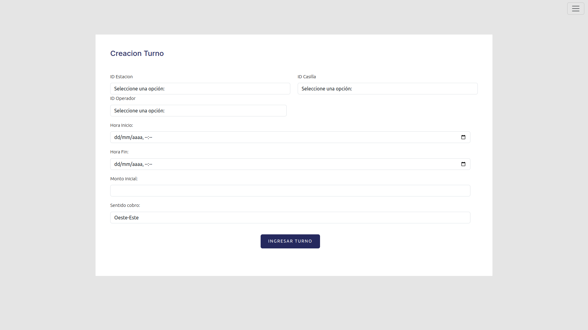
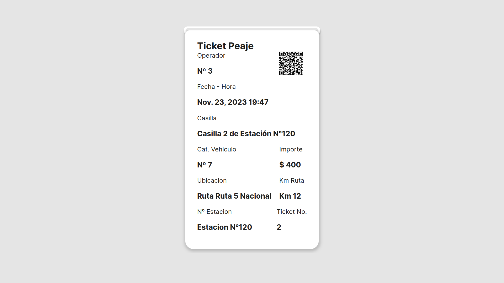

# Toll System

[Introduction](#Introduction)

[Installation](#Installation)

[Images](#Entity-Relationship-Diagram-of-the-System)


## Introduction
This project aims to implement a toll management and control system with the purpose of efficiently managing revenue at all stations on the roads of the province of Córdoba.


## Installation

### Prerequisites

Python 3.10 required:

*input:*
```bash
    python --version
```

*output:*
```bash
    Python <versionNumber>
```
<hr>

Django required:

*input:*
```bash
    pip install Django
```
<hr>

Pipenv required:

*input:*
```bash
    pip install pipenv
```

<hr>

#### Step 1: Creating a Virtual Environment

Working with virtual environments is crucial as it helps to avoid issues related to library and package dependencies.

```bash
    pipenv install //Creacion
    pipenv shell //Ejecucion
```

#### Step 2: Installation of Required Modules for Execution

Once inside the virtual environment, we need to install all the packages needed to develop/execute the project.

```bash
    pipenv install -r requirements.txt
```

>After following these steps, you should be able to execute and/or work on the project without any issues.


## Entity-Relationship Diagram of the System


## Class Diagram of the System


## Screenshots





