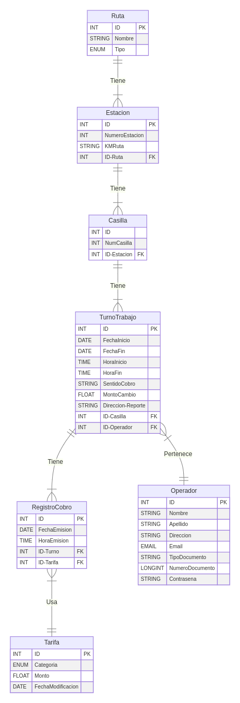

# Sistema de Peaje

[Introduccion](#introduccion)

[Instalacion](#instalacion)

[Diagrama Entidad-Relacion](#diagrama-entidad-relacion-del-sistema)


## Introduccion
Es un sistema de gestor y control de peaje. El objetivo principal del proyecto es administrar eficientemente la recaudación de peajes en cada estación todas las rutas de la provinvia de cordoba.


## Instalacion

### Requisitos previos

Debes tener python instalado:

*input:*
```bash
    python --version
```

*output:*
```bash
    Python <numeroVersion>
```
<hr>

Debes tener algun gestor de entornos virtuales instalado, en este caso, nosotros utilizamos *__pipenv__*

*input:*
```bash
    pipenv --version
```

*output:*
```bash
    pipenv, version <numeroVersion>
```

<hr>

#### Primer paso: Creacion Entorno Virtual

Va a ser muy importante trabajar con entornos virtuales ya que nos ayudará a evitar problemas relacionados con dependencias de bibliotecas y paquetes.

```bash
    pipenv install //Creacion
    pipenv shell //Ejecucion
```

#### Segundo paso: Instalacion de los modulos requeridos para su ejecucion

Una vez que estamos dentro del entorno virtual, debemos instalar todos los paquetes que se necesitaran para desarrollar/ejecutar el proyecto

```bash
    pipenv install -r requirements.txt
```

>Una vez hayas seguido estos pasos, podrás ejecutar y/o trabajar en el proyecto sin ningún problema.

## Diagrama Entidad-Relacion del sistema


# Ejemplo Estructura BD

### Ruta

| idRuta | Nombre | DistanciaTotal |
| --- | --- | --- |
| 501 | Ruta 5 | 100 KM |
| 502 | Ruta 20 | 300 KM |
| 503 | Ruta 7 lagos | 90 KM |

### Estacion

| idEstacion | idRuta | Nombre | Kilómetro |
| --- | --- | --- | --- |
| 101 | 501 | Estación Peaje A1 | 50 |
| 102 | 502 | Estación Peaje B2 | 30 |
| 103 | 503 | Estación Peaje C3 | 75 |


### Casillero

| idCasillero | idEstacion | NumeroCasilla |
| --- | --- | --- |
| 201 | 101 | 2 |
| 202 | 102 | 3 |
| 203 | 103 | 1 |

### Operador

| idOperador | Nombre | Edad | FechaNacimiento | Domicilio | Telefono | DNI |
| --- | --- | --- | --- | --- | --- | --- |
| 301 | María Rodríguez | 32 | 1989-05-15 | Calle 123, Ciudad | (123) 456-7890 | 12345678 |
| 302 | Juan Pérez | 28 | 1995-08-20 | Avenida 456, Otra Ciudad | (987) 654-3210 | 98765432 |
| 303 | Carlos Sánchez | 25 | 1987-03-10 | Calle 789, Ciudad Vecina | (555) 123-4567 | 55555555 |

### TurnoTrabajo

| idTurnoTrabajo | idCasillero | idOperador | FechaInicio | FechaFin | SentidoCobro | MontoInicial | Estado |
| --- | --- | --- | --- | --- | --- | --- | --- |
| 401 | 201 | 301 | 2023-01-15 08:00:00 | 2023-01-15 16:00:00 | Norte-Sur | 1000 | En Curso |
| 402 | 202 | 302 | 2023-01-16 14:00:00 | 2023-01-16 22:00:00 | Sur-Norte | 2000 | Hecho |
| 403 | 203 | 303 | 2023-01-17 06:00:00 | 2023-01-17 14:00:00 | Oeste-Este | 500 | En Curso |

### Tarifa

| idTarifa | Tipo Vehiculo | Monto | Marca | Modelo |
| --- | --- | --- | --- | --- |
| 701 | Motocicleta | $45 | Honda | CL500 |
| 702 | Automóvil | $90 | Toyota | Corolla |
| 703 | 3 0 4 ejes | $180 | Mercedez | Citan |

### RegistroCobro

| idRegistroCobro | idTarifa | idTurno | FechaHoraEmision |
| --- | --- | --- | --- |
| 801 | 701 | 401 | 2023-02-15 09:20:10 |
| 802 | 702 | 402 | 2023-02-15 09:30:15 |
| 803 | 703 | 403 | 2023-02-15 09:56:00 |